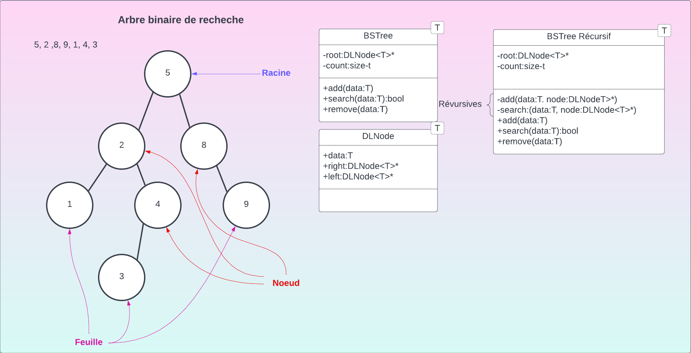
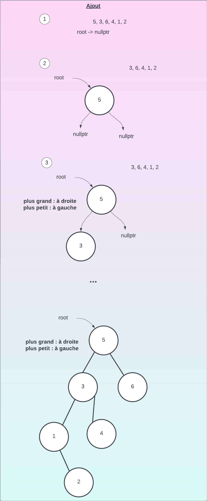
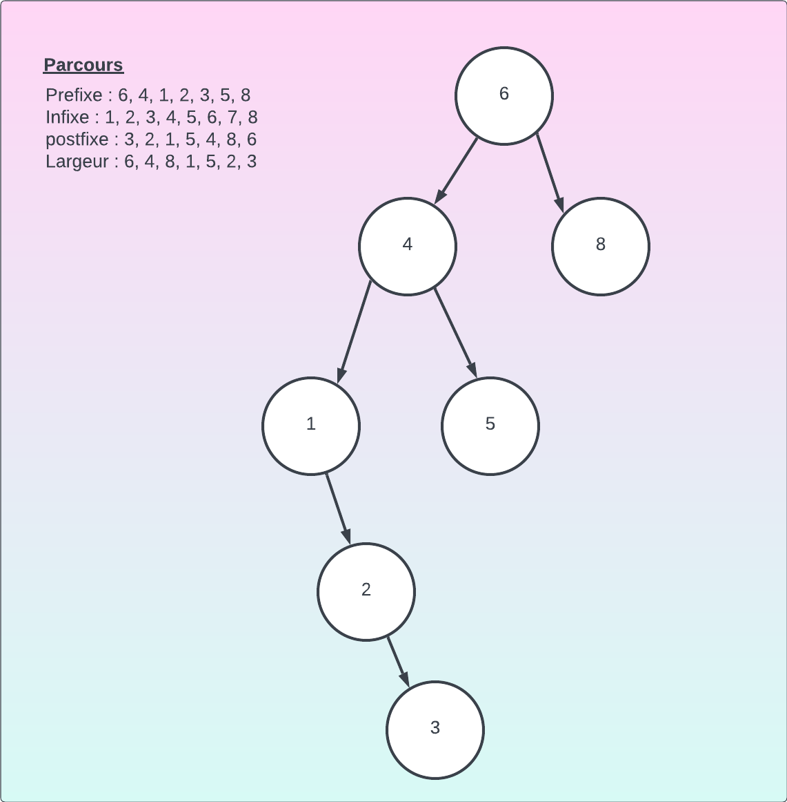

## Ajout
Étape :
1. Si le nombre est plus petit, aller à gauche
2. Si le nombre est plus grand, aller à droite

## Parcours
- **Prefixe** (preorder)
  1. Ajouter la donnée au parcours
  2. Aller à gauche
  3. Aller à droite
- **Infixe** (inorder)
  1. Aller à gauche
  1. Ajouter la donnée au parcours
  1. Aller à droite
- **Postfixe** (postorder)
  1. Aller à gauche
  1. Aller à droite
  1. Ajouter la donnée au parcours
- **Largeur** (breathfirst)
  1. Aller de gauche à droite
  2. Descendre et repartir de la gauche
  3. 
- 