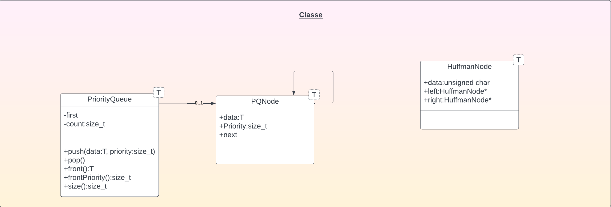
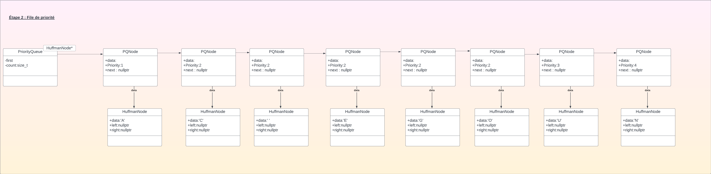
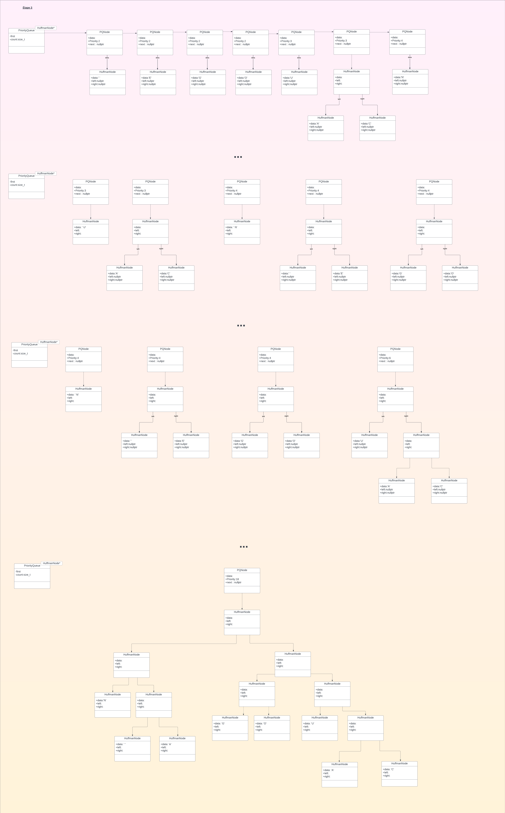

# TP3
## Classes nécessaires
- File de priorité
- Noeud de file de priorité
- Noeud de Huffman

## Codage de huffman
1. Recensement
2. File de priorité
3. Construction de l'arbre de Huffman
4. Encodage
5. Chiffrement

### Exemple
CANCUN EN GOUGOUNE

### Étape 1 : Recensement
- C : 2
- A : 1
- N : 4
- U : 3
- Espace: 2
- E : 2
- G : 2
- O : 2

## Étape 2 : File de priorité

## Étape 3 : Construction de l'arbre de Huffman
Tant que la file de priorité ne contient pas qu'une seule donnée :
- Défiler les deux premières données
- Créer un nouveau noeud ayant comme priorité la somme des priorités des 2 noeuds défilés
- L'enfiler

## Étape 4 : Encodage
Gauche = 0, droite = 1
- C : 2 : 1111
- A : 1 : 1110
- N : 4 : 00
- U : 3 : 110
- Espace: 2 : 010
- E : 2 : 011
- G : 2 : 100
- O : 2 : 101

Clé : C:2, A:1, N:4...

## Étape 5 : Chiffrement
CANCUN EN GOUGOUNE : \
1111 1110 00111111 00001001 10001010 01011101 00101110 00011000

## Déchiffrement
Recréer l'arbre à partir de la clé, puis suivre le chemin

- Créer l'arbre avec la clé (C:2, A:1, N:4...)
- Suivre le chiffrement (1111 1110 00111111...) jusqu'à atteindre une feuille.
- Répété jusqu'à atteindre la priorité total (car la priorité total = nbe de caractères).