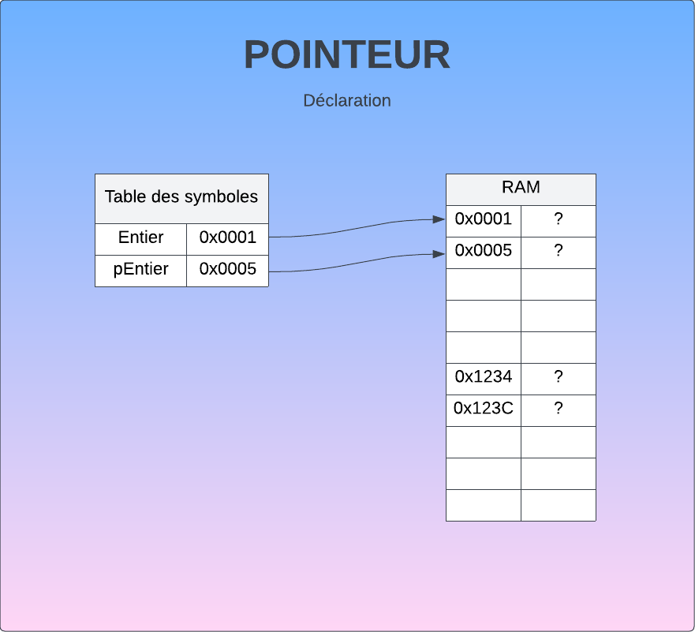

# Pointeur
## Description 
Variable qui contient une adresse de la mémoire centrale, plutôt qu'une valeur.

## Déclaration
```cpp
int entier;
int* pEntier;
```


## Allocation
```cpp
pEntier = new int; //Équivalent du malloc
```
**Attention :** Lorsqu'il y a un new, il doit y avoir un [delete](#déréférencement)


```cpp
entier = 3;
*pEntier = 5;
```


## Indirection
```cpp
*pEntier = 43;
```


## Déréférencement
```cpp
pEntier = &entier; // Le & permet d'obtenir l'adresse d'une variable
```


## Libération
```cpp
delete pEntier;
```
La libération de mémoire n'initialise pas à zéro (opération inutile), elle libère l'espace réservé.

## Pointeur null
`nullptr` pointe sur l'adresse 0
```cpp
pEntier = nullptr;
```


# Exemple
## Exemple 1 (Allocation et libération)


## Exemple 2 (Déréférencement)


