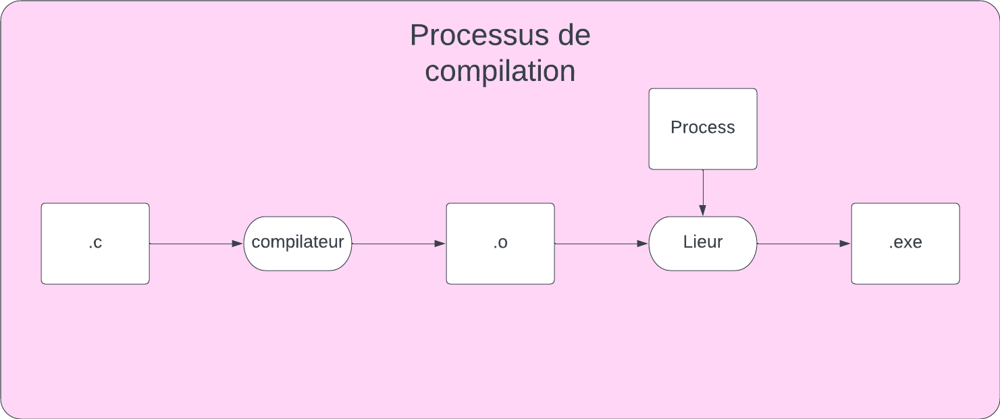
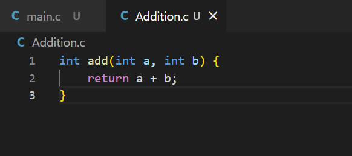

# Processus de compilation


# Creation de libraries

```ps
gcc -c ./Addition.c
ar -rcs ./libAddition.a ./Addition.o
```

```ps
gcc ./main.c -o Programme.exe -L. -lAddition
```

# Documentation
Fichier : 
```
/// \File nomFichier.ext
/// \Author Prenom Nom (courriel)
/// \brief description
```

Fonction :
```
/// \Brief description
/// \Param identificatuer description
/// \return descripiton
```