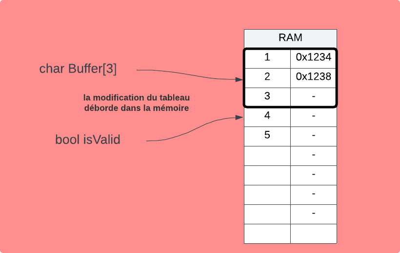

```c
int main() 
{
  char buffer[15];
  bool isValid = false;

  printf("Passphrase : ");
  scanf("%s", buffer);

  if(!strcmp(buffer, "123456"))
    isValid = true;

    printf(isValid ? "Success\n" : "Fail\n");
}
```