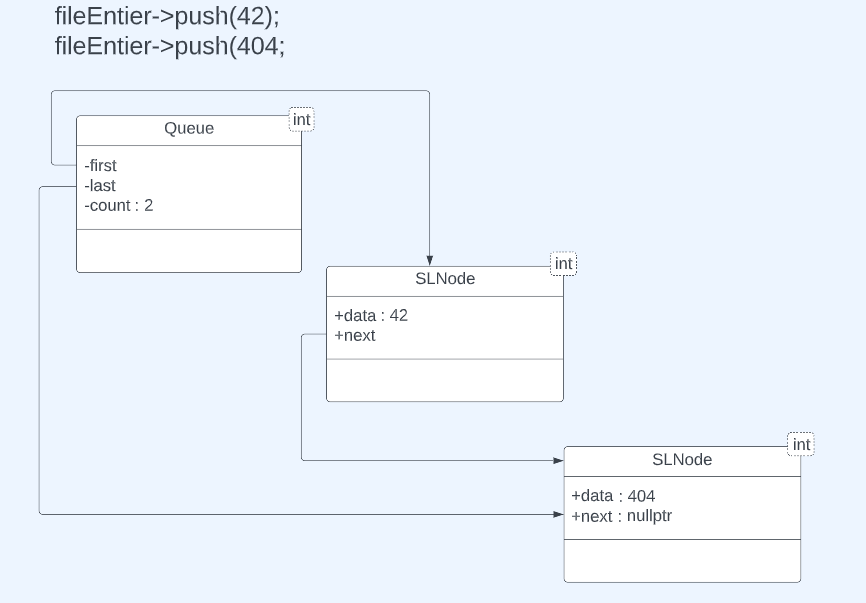

# Limitaion de la pile en C
- Réutilisation --> Fichier d'en-tête
- Plusieurs instances --> Structures
- Limitation/Gaspille de mémoire --> Allocation dynamique et libération
- Robustesse
- Convivialité
- Type imposé

# Pile CPP


```cpp
Queue<int> fileEntiers = new Queue<int>();
fileEntier->push(42);
fileEntier->push(404);
```
