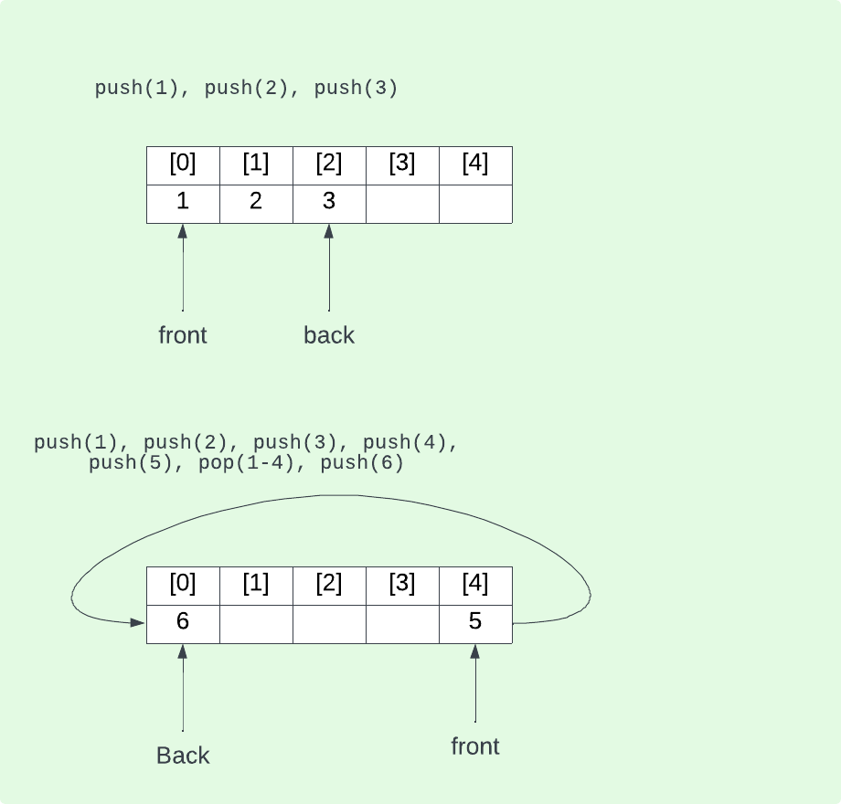

# File (Queue)
## Type
- FIFO (First in, first out)
- On rentre à la fin et on sort au début
- Circulaire
## Accès
- Devant (front)
- Derrière (back)
## Fonctionnalités
- Enfiler (push)
- Défiler (pop)
- Front
- Back
- Compte (size)



## Push
```
Push(Enfiler) : (frontIndex + count++) % length;
frontIndex = (frontIndex + 1 % length);
count--;
```