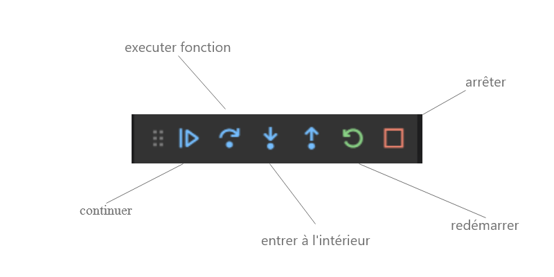

## ENTIER
- char : 1 octet
- short : 2 octets
- int : 3 octets
- long : 4 octets

peuvent être unsigned

## RÉELS
- Float 4 octets
- Double 8 octets

## DÉCLARATION DE VARIABLES
Type indicateur;
- Débute tjrs par une lettre ou un tiret (-)
- Contient que des lettres, chiffres, et tiret (-)
- Pas de terme qui existe dans le language (example : if)
- \* après le type pour un pointeur

```c
int entierA, entierB, entierC;
int entier1 = 12, entier2;
int* pEntier2;
```

## TABLEAU
Type identificateur[N];

```c
int tabEntiers[5];
```

Les chaines doivent contenir un caractères supplémentaire (0) pour dire au printf quand arrêter de lire. Example:
```c

int main() {
    char chaineA[7] = "Bonjour"; //ERREUR
    char chaineB[5] = "Salut"; //ERREUR

    printf("%s", chaineB);
    return 0;
}
```
Output:


### String 
char chaine[N + 1] La dernière case doit toujours être zéro

## POINT D'ENTRÉE
```c
int main() {
    return 0;
}
```
ou
```c
int main(int argc, char* argv[]) {
    return 0;
}
```
ou
```c
void main() {
    return 0;
}
```

## MACRO
### Define
(rechercher remplacer)
```c
#define IDENTIFCATEUR (constante)
#define PI 3.14159
#define TPS 5
#define TVQ 9.975
```


### Include
```c
#include <nomFichier ext> // Bibliothèque système
#include "nomFichier.ext" // fichier de projet

(copier coller)
```

### FRAGMA ONCE
```c
#fragma once //Inclure une seul fois
```
```c
#ifndef HEADER_H
#define HEADER H
```

## Définition de type
```c
typedef unsigned char byte;
```

## stdbool.h
```c
#define FALSE 0
#define TRUE 1

typedef unsigned char bool
```

## Oprérateurs
Arithmétiques : =, +, -, *, /, %, ++, -- \
relationels : ==, <, <=, >, >=, != \
logique :
- bitwise : |, &
- logique : ||, &&

incrémentation
```c
int i = 0;

++i; //pre
i++; //post
```

## IF
```c
if (condition) {
    instructionA();
}
else {
    instructionB();
}
```

## Switch
```c
int i = 4;

switch(i) {
    case 1:
        instructionA();
        break;
    case 4:
        instructionB();
    case 5:
        instructionC();
        break;
    case 6:
        instructionD();
        break;
}
// Le break permet de sortir du case, donc ici, puisqu'il n'y a pas de break dans le case 4, instructionC() sera aussi exécuté
```
## Structure de répétition
tant que :
```c
while (condition) {
    instructionA();
    instructionB();
}

do {
    instructionC();
    instructionD();
} while (condition);
// Différence avec le while : Le do while s'exécute au moins une fois même si la condition est fausse
```
pour
```c
for (initialisation; condition; postitération) {
    conditionA();
}

for (int i = 0; i < 42; i++) {
    conditionA();
}

```
## gcc
- `gcc main.c`
- `gcc main.c -o programme.exe `
- `gcc -g main.c `


## Débuging


## Pile
Type : L.I.F.O \
Accès : Dessus \
Fonctionalité :
- Empiler (push)
- Dépiler (pop)
- Compte (size)

Représentation :
- SS (tableau représentant la pile)
- SP (indice du tableau de la pile)

## Struct
```c
struct Chien {
    char race[30];
    int age; // Une variable de peut pas être initialisé dans une struct
};

struct ArrayStack chien1;

chien1.age = 12;

//...
```
## Pointeur
Adresse en mémoire centrale
```c
int entier; // valeur entière
int* pEntier; // Adresse en mémoire centrale où se trouve une valeur entière

entier = 42;
```


```c
pEntier = malloc(sizeof(int)); // Pour allouer de la mémoire de X size
```

```c
free(pEntier); // Pour libérer la mémoire
```

## Passage des arguments aux paramètres
- Par valeur (copie)
- Par référence
- Par pointeur