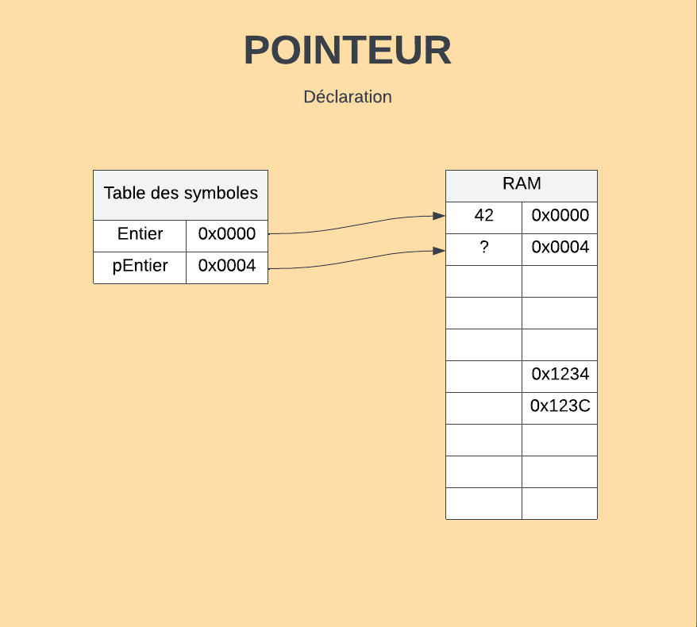
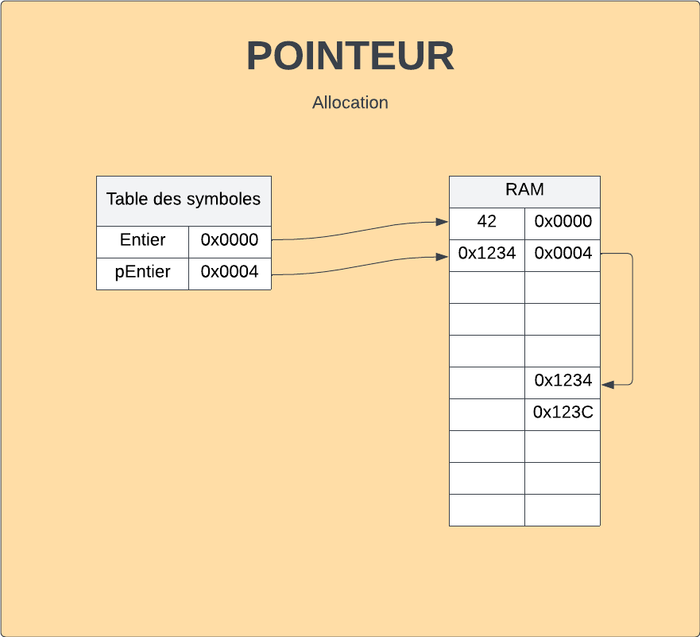
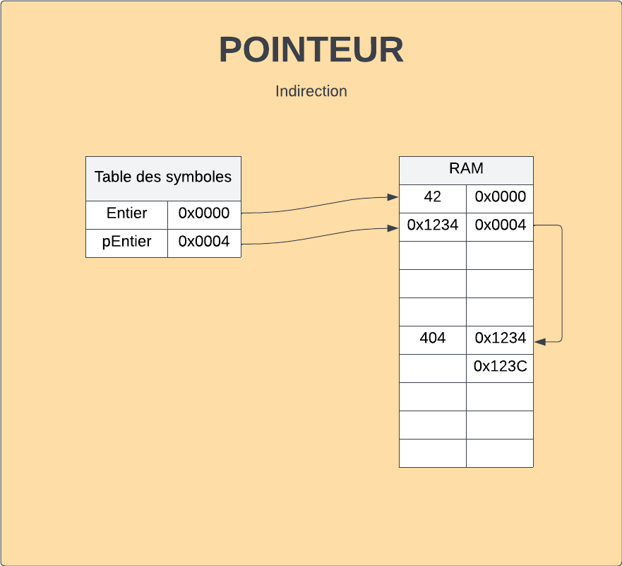
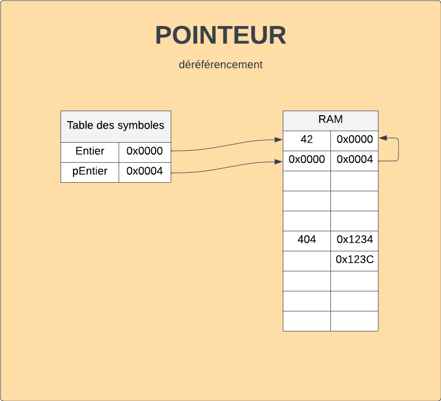

# Pointeur
## Description 
Variable comme une autre mais qui contient une adresse de la mémoire centrale, plutôt qu'une valeur.

## Déclaration
```c
int entier; // Contient une valeur entière
int* pEntier; // Contient un adresse de la mémoire centrale où se trouve une valeur entière.
```
 <!--set max width-->
## Allocation
```c
malloc(nbeOctets);
malloc(sizeof(int));
malloc(4);
```
 <!--set max width-->

## Libération
```c
free(pEntier);
```
La libération de mémoire n'initialise pas à zéro (opération inutile), elle dit seulement que l'espace est disponible

## Indirection
```c
*pEntier=404;
```
 <!--set max width-->

## Déréférencement
```c
pEntier = &entier //Va chercher l'adresse de lal variable visé
```
 <!--set max width-->

```c
pEntier = &entier;
*pEntier = 666;
printf("%i", entier); //output = 666
```