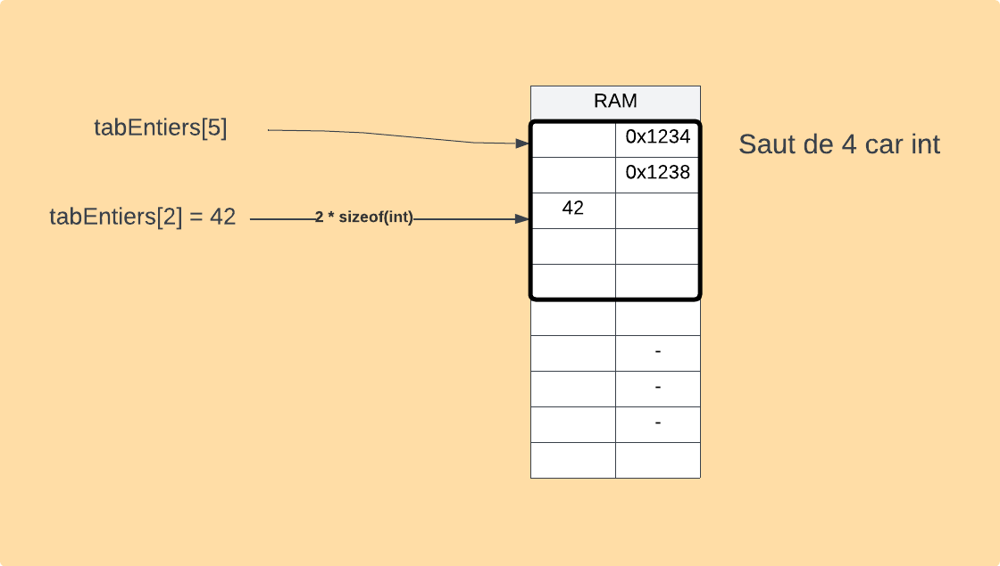

# Pointeur
## Description 
Variable qui contient une adresse de la mémoire centrale, plutôt qu'une valeur.

## Déclaration
### C
```cpp
int entier;
int* pEntier;
```

 <!--set max width-->
## Allocation
```cpp
pEntier
```
 <!--set max width-->

## Libération
```c
free(pEntier);
```
La libération de mémoire n'initialise pas à zéro (opération inutile), elle dit seulement que l'espace est disponible

## Indirection
```c
*pEntier=404;
```
 <!--set max width-->

## Déréférencement
```c
pEntier = &entier //Va chercher l'adresse de lal variable visé
```
 <!--set max width-->

```c
pEntier = &entier;
*pEntier = 666;
printf("%i", entier); //output = 666
```

## Tableau
Dans un tableau, le pointeur pointe vers le premier octet de la suite

```c
int tabEntiers[5]; // int* tabEntiers = malloc(5*sizeof(int))
tabEntiers[2] = 42;
```


## Chaine de caractères
Tableau de caractères se terminant par la valeur 0.
```c
char tabCaracteres[5] = {'A', 'L', 'L', 'O', 0} // Se termine par zéro pour annoncé la fin de la chaine
```
### Fonction
```c
#include <string.h>
size.t stlen(chaine);
void strcopy(destination, source);
int strcmp(chaineA, chaineB); // EN ORDRE ASCII : < 0 cahineA vient avant chaine B, == identiques, > 0 chaineA viens apres chaineB
sprintf(destination, format, donnees); //Comme le printf, mais store le resultat dans "Destination" au lieu de le print
```

